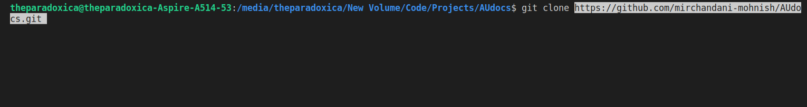
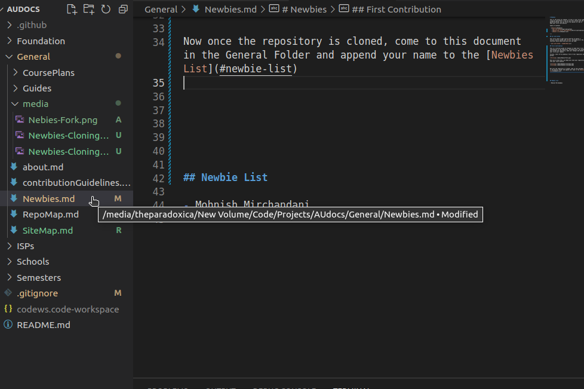
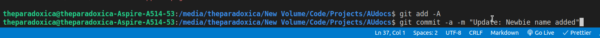

# Newbies

This is the place for newbies. If this is your first time using git and github or you are not well versed with the github workflow, you can follow this guide as a way to make your first contribution.

Table of Contents

- [Newbies](#newbies)
  - [Git and Github](#git-and-github)
  - [Making your First Contribution](#first-contribution)
  - [Newbie List](#newbie-list)

---

## Git and Github

Your first step to open source would be to master a version control system like [Git](). Following are a few tutorials which would help you with the same.

- [Git and Github - CodeWithHarry]()

## First Contribution

This is a tutorial guide for Newbies to make their first contribution to the repository. Following this, you would have forked the repository, made your changes and opened your first pull request.

Firstly, start off by making a fork of this repository on github.

Once you've done this, go ahead and clone your repository into your local machine.

Now once the repository is cloned, come to this document in the General Folder and append your name to the [Newbies List](#newbie-list)

You can now add and commit your changes and push them to your repository.

Once you have done that. You should be able to see the changes on your fork i.e. on (YourName)/AUdocs.

Now you need to open a new pull request. For that, go to the 'pull requests' tab on github and click 'New pull request'.

Fill in the valid details and create a pull request.

## Newbie List

- Mohnish Mirchandani
